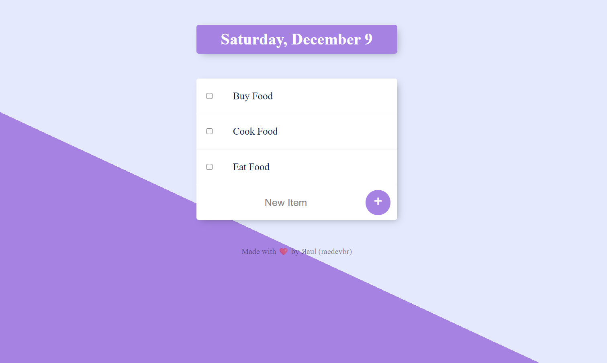

# To Do List - Sample

**How to use:** 
1. Make a clone for your local repository
2. Inside project folder root path, type this in terminal: 'node app.js' or 'nodemon app.js' (the server will start on PORT 3000 and you can use the app now)
    * If you want to install nodemon, [click here](https://www.npmjs.com/package/nodemon) and follow the steps
3. Open any browser and type **'localhost:3000'**.
4. You can also access **'localhost:3000/work'** for Work List items
5. Currently you cannot remove items unless the server is stopped, but if you want to contribute feel free to open a PR
6. Type 'Ctrl + C' in terminal to stop the server

*Hope you enjoy it* 🙃  
*Feel free to open an issue or PR for contribute with the project* ❤️ 

**External dependencies used in this project (*commonjs*):**
* 'express'
* 'body-parser'
* 'ejs'